# OneBlood — System Architecture Document

**Version:** 1.0  
**Date:** June 12, 2026  
**Author:** Solution Architecture Team  
**Status:** Draft

---

## Table of Contents

1. [High-Level Architecture](#1-high-level-architecture)
2. [Component Breakdown](#2-component-breakdown)
3. [Service Interactions](#3-service-interactions)
4. [Request Flow Diagrams](#4-request-flow-diagrams)
5. [Notification Architecture](#5-notification-architecture)
6. [Database Architecture](#6-database-architecture)
7. [Security Architecture](#7-security-architecture)
8. [Deployment Architecture](#8-deployment-architecture)
9. [Scaling Strategy](#9-scaling-strategy)

---

## 1. High-Level Architecture

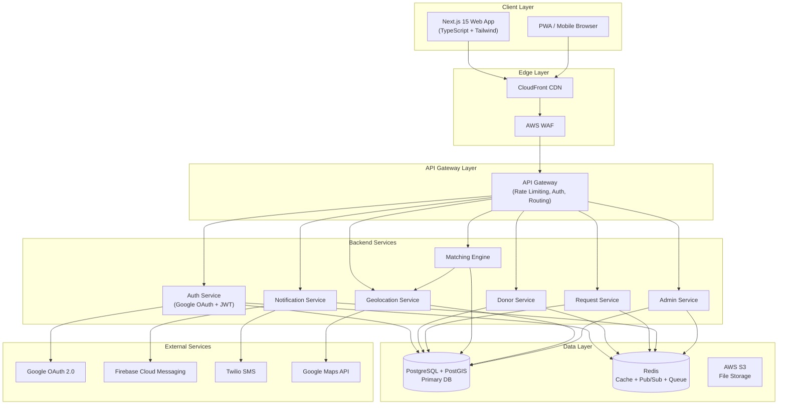

---

## 2. Component Breakdown

### 2.1 Frontend — Next.js 15

| Module | Responsibility |
|--------|---------------|
| **App Router** | File-based routing, layouts, server components |
| **Auth Module** | Google OAuth flow, JWT storage (httpOnly cookie) |
| **Donor Module** | Profile setup, availability toggle, donation history |
| **Request Module** | Create/view blood requests, SOS trigger |
| **Map Module** | Google Maps integration, donor proximity visualization |
| **Notification Module** | WebSocket client, FCM service worker, notification center |
| **Admin Module** | Dashboard, analytics, user management (role-gated) |

**Key Frontend Decisions:**
- Server Components for initial data fetching (SEO + performance)
- Client Components only for interactive elements (map, real-time)
- Service Worker for FCM push notifications
- React Query for client-side caching and background refresh
- Zustand for lightweight global state (auth, notifications)

---

### 2.2 Backend Services

Each service is an Express.js module within a monorepo. They share a common middleware layer but can be extracted to independent microservices when scaling demands it.

#### Auth Service
- Handles Google OAuth 2.0 callback
- Issues access tokens (JWT, 1h TTL) and refresh tokens (30d TTL, stored in Redis)
- Validates tokens on all protected routes via shared middleware
- Blacklists tokens on logout via Redis

#### Donor Service
- CRUD for donor profiles
- Eligibility validation (age, weight, blood type)
- Availability status management
- Cooldown enforcement (reads last donation date)

#### Request Service
- CRUD for blood requests
- Expiry scheduling via Redis TTL + Bull queue
- Request lifecycle: `OPEN → MATCHED → FULFILLED / EXPIRED / CANCELLED`

#### Matching Engine
- Triggered when a new request is created
- Queries PostGIS for donors within the request's radius
- Filters by blood compatibility rules
- Returns sorted donor list (nearest first)
- Pushes matched donor IDs to Notification Service via Redis pub/sub

#### Notification Service
- Subscribes to Redis channels for match events
- Dispatches FCM push to matched donors
- Dispatches Twilio SMS for SOS requests
- Broadcasts real-time updates via WebSocket (Socket.io)
- Tracks notification delivery status in DB

#### Geolocation Service
- Geocodes hospital addresses to lat/lng via Google Maps API
- Updates donor location points in PostGIS
- Provides distance calculations for request views

#### Admin Service
- Aggregate analytics queries (fulfilled rate, avg response time)
- Account management (suspend, verify)
- Report generation and CSV export

---

### 2.3 Infrastructure Components

| Component | Technology | Purpose |
|-----------|-----------|---------|
| API Gateway | AWS API GW / custom Express gateway | Routing, rate limiting, auth |
| Cache | Redis 7 (Cluster) | Session, query cache, pub/sub, job queue |
| Message Queue | Bull (Redis-backed) | Async jobs (notifications, expiry, reports) |
| WebSocket Server | Socket.io | Real-time donor/request status updates |
| CDN | AWS CloudFront | Static assets, edge caching |
| Object Storage | AWS S3 | Profile images, CSV exports |
| Secret Management | AWS Secrets Manager | DB credentials, API keys |

---

## 3. Service Interactions

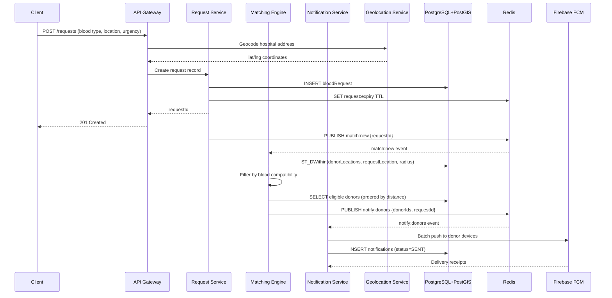

---

## 4. Request Flow Diagrams

### 4.1 Authentication Flow

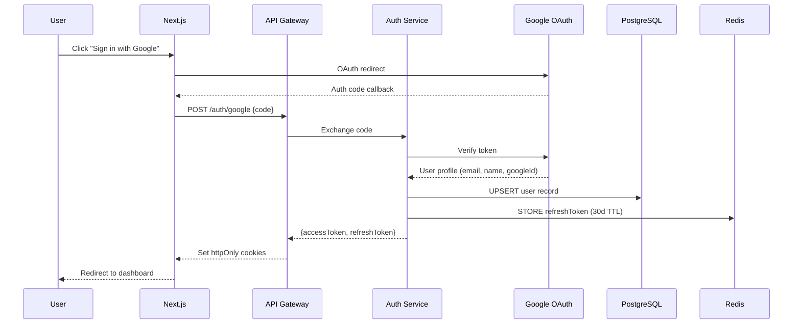

---

### 4.2 SOS Request Flow

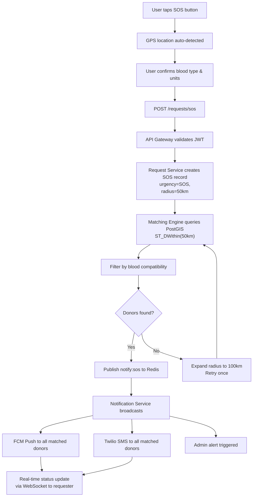

---

### 4.3 Donor Response Flow

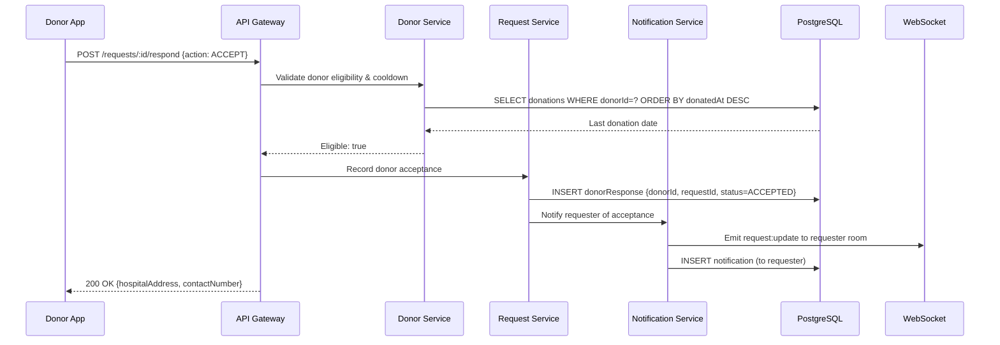

---

## 5. Notification Architecture

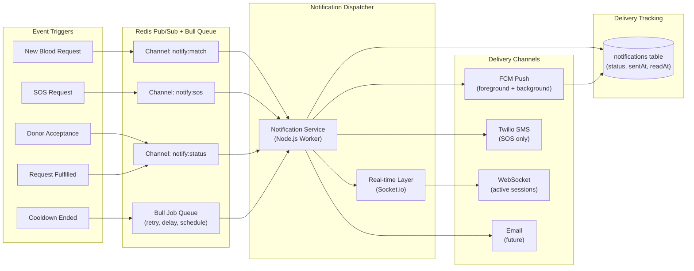

### Notification Delivery Rules

| Event | FCM Push | SMS | WebSocket | Priority |
|-------|----------|-----|-----------|----------|
| New Normal Request | ✅ | ❌ | ✅ | Normal |
| New Urgent Request | ✅ | ❌ | ✅ | High |
| SOS Request | ✅ | ✅ | ✅ | Critical |
| Donor Accepted | ✅ | ❌ | ✅ | High |
| Request Fulfilled | ✅ | ❌ | ✅ | Normal |
| Cooldown Ended | ✅ | ❌ | ❌ | Low |

### Retry Strategy
- **FCM failures**: 3 retries with exponential backoff (1s, 3s, 9s)
- **SMS failures**: 2 retries, fallback to push notification
- **Dead Letter Queue**: Failed jobs after all retries stored for manual review

---

## 6. Database Architecture

### 6.1 Entity Relationship Diagram

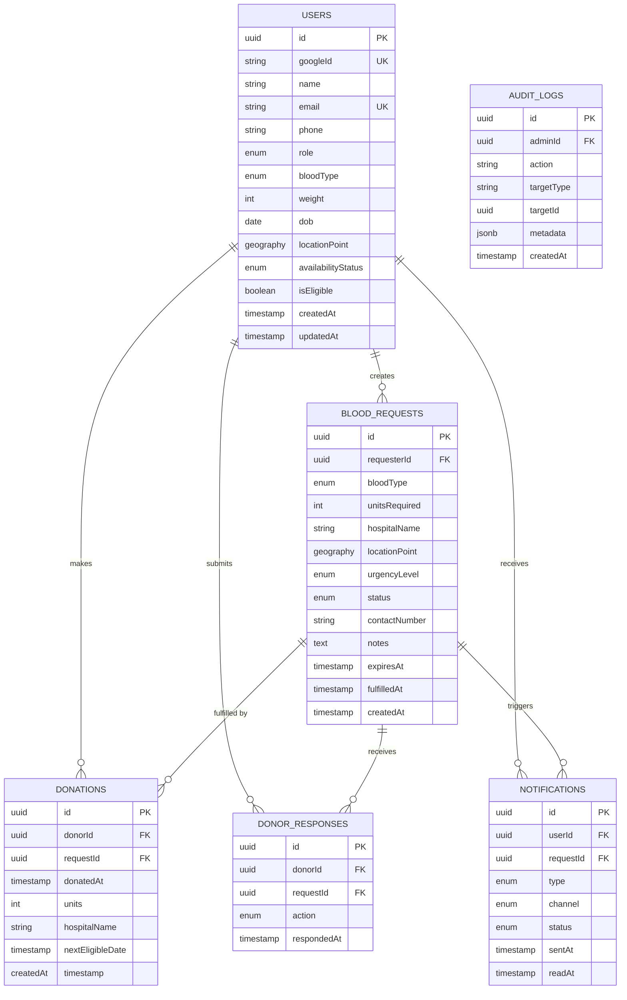

---

### 6.2 PostGIS Spatial Design

```sql
-- Donor location stored as PostGIS GEOGRAPHY point
ALTER TABLE users ADD COLUMN location_point GEOGRAPHY(POINT, 4326);

-- Spatial index for fast proximity queries
CREATE INDEX idx_users_location ON users USING GIST(location_point);

-- Request location
ALTER TABLE blood_requests ADD COLUMN location_point GEOGRAPHY(POINT, 4326);
CREATE INDEX idx_requests_location ON blood_requests USING GIST(location_point);

-- Geospatial matching query (example: 10km radius)
SELECT u.id, u.name, u.blood_type,
       ST_Distance(u.location_point, r.location_point) AS distance_meters
FROM users u
JOIN blood_requests r ON r.id = $requestId
WHERE u.availability_status = 'ACTIVE'
  AND u.blood_type = ANY($compatibleTypes)
  AND ST_DWithin(u.location_point, r.location_point, $radiusMeters)
ORDER BY distance_meters ASC
LIMIT 50;
```

---

### 6.3 Redis Key Design

| Key Pattern | Type | TTL | Purpose |
|-------------|------|-----|---------|
| `session:{userId}` | Hash | 30d | Refresh token store |
| `blacklist:{token}` | String | 1h | Revoked access tokens |
| `request:expiry:{requestId}` | String | Dynamic | Request auto-expiry trigger |
| `cooldown:{donorId}` | String | 90d | Donor cooldown flag |
| `ratelimit:{ip}:{route}` | Counter | 1min | Per-IP rate limiting |
| `geo:donor:{donorId}` | String | 1h | Last known donor location cache |
| `notify:match` | Pub/Sub channel | — | Match events |
| `notify:sos` | Pub/Sub channel | — | SOS broadcast events |
| `queue:notifications` | Bull Queue | — | Notification job queue |

---

## 7. Security Architecture

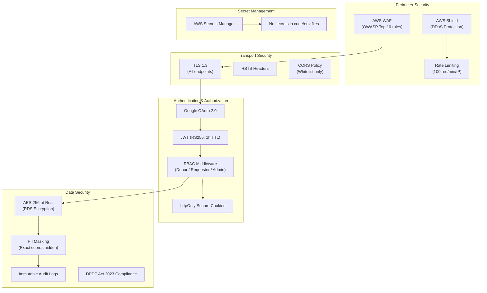

### 7.1 Security Controls Summary

| Layer | Control | Implementation |
|-------|---------|---------------|
| **Network** | DDoS protection | AWS Shield Standard |
| **Network** | WAF rules | OWASP Top 10, SQL injection, XSS |
| **Transport** | Encryption | TLS 1.3 enforced, HSTS |
| **Auth** | Token signing | RS256 asymmetric JWT |
| **Auth** | Token storage | httpOnly + Secure + SameSite=Strict cookies |
| **Auth** | Token revocation | Redis blacklist on logout |
| **API** | Rate limiting | 100 req/min/IP; 10 req/min for SOS |
| **API** | Input validation | Zod schema validation on all routes |
| **Data** | At-rest encryption | AES-256 (AWS RDS + S3) |
| **Privacy** | Location masking | Only distance shown; coordinates never exposed |
| **Admin** | Audit trail | All admin actions logged (immutable) |
| **Compliance** | DPDP Act 2023 | Consent capture, data deletion on request |

### 7.2 Privacy Design — Donor Location

```
Donor registers → exact lat/lng stored in PostGIS (server-only)
                      ↓
Request created → matching query runs on server (no coords sent to client)
                      ↓
Donor matched → recipient sees only: "2.4 km away"
                      ↓
Donor accepts → recipient gets hospital address (not donor home location)
```

---

## 8. Deployment Architecture

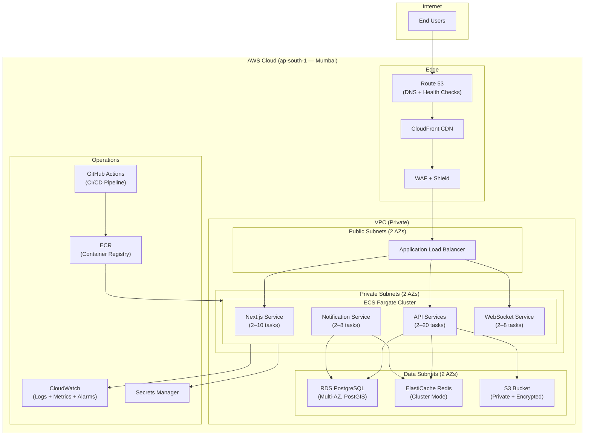

### 8.1 CI/CD Pipeline

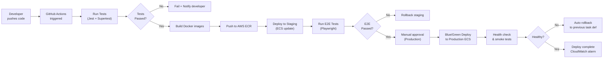

---

## 9. Scaling Strategy

### 9.1 Auto-Scaling Configuration

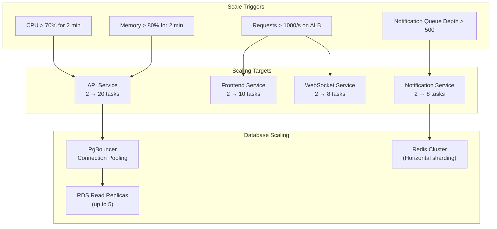

---

### 9.2 Load Targets by Phase

| Phase | Users | Req/s (peak) | Strategy |
|-------|-------|-------------|----------|
| **MVP** | 10K concurrent | ~500 | Single region, 2 AZs, ECS Fargate |
| **Growth** | 100K concurrent | ~5,000 | Read replicas, Redis Cluster, CDN expansion |
| **Scale** | 1M concurrent | ~50,000 | Multi-region (Mumbai + Delhi), Global ALB, ElasticSearch for analytics |

---

### 9.3 Caching Strategy

| Data | Cache Layer | TTL | Invalidation |
|------|------------|-----|-------------|
| Blood compatibility rules | In-memory (app start) | Indefinite | Code deploy |
| Donor geolocation | Redis | 1 hour | On location update |
| Active requests by city | Redis | 30 seconds | On new request / fulfillment |
| User profile | Redis | 15 minutes | On profile update |
| Analytics aggregates | Redis | 5 minutes | Scheduled job |
| JWT blacklist | Redis | Token TTL | On logout |

---

### 9.4 Database Optimization

```sql
-- Critical indexes for performance at scale

-- 1. Spatial index (already defined in §6.2)
CREATE INDEX idx_users_location ON users USING GIST(location_point);

-- 2. Composite index for eligibility filtering
CREATE INDEX idx_users_eligibility
  ON users(availability_status, blood_type)
  WHERE availability_status = 'ACTIVE';

-- 3. Active requests lookup
CREATE INDEX idx_requests_active
  ON blood_requests(status, blood_type, created_at)
  WHERE status = 'OPEN';

-- 4. Donor response lookup
CREATE INDEX idx_donor_responses_request
  ON donor_responses(request_id, action);

-- 5. Notification status tracking
CREATE INDEX idx_notifications_user_unread
  ON notifications(user_id, read_at)
  WHERE read_at IS NULL;

-- 6. Donations cooldown check
CREATE INDEX idx_donations_donor_date
  ON donations(donor_id, donated_at DESC);
```

---

## Appendix — Technology Decisions

| Decision | Choice | Rationale |
|----------|--------|-----------|
| Monorepo vs Microservices | Modular Monorepo (MVP) → Microservices (Scale) | Faster iteration at MVP; clean module boundaries enable extraction later |
| WebSockets vs SSE | Socket.io (WebSockets) | Bidirectional needed for donor-response real-time; SSE is unidirectional |
| Bull vs SQS | Bull (Redis-backed) for MVP | Simplicity; migrate to SQS when notification volume exceeds Redis capacity |
| PgBouncer | Connection pooling at scale | PostgreSQL has finite connections; pooler prevents exhaustion under ECS task spikes |
| JWT algorithm | RS256 (asymmetric) | Verification-only nodes don't need signing key; more secure than HS256 |
| Blue/Green deploy | Zero downtime | Blood donation is life-critical; no rolling restarts that could drop active SOS flows |

---

*Document Owner: OneBlood Architecture Team*  
*Last Updated: June 12, 2026*  
*Next Review: July 1, 2026*
