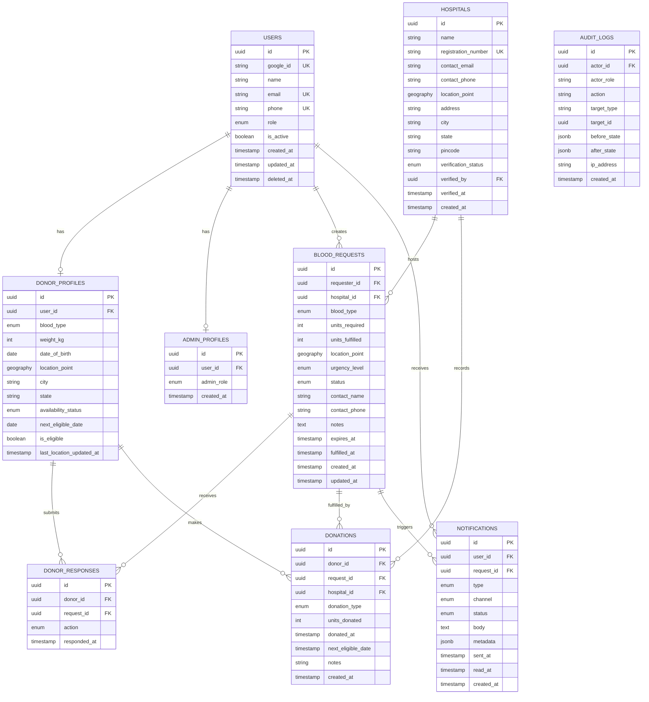

# OneBlood — Database Architecture

**Version:** 1.0 | **Date:** June 12, 2026 | **Engine:** PostgreSQL 15 + PostGIS 3.4

---

## 1. ER Diagram



---

## 2. SQL — Extensions & Enums

```sql
-- ============================================================
-- EXTENSIONS
-- ============================================================
CREATE EXTENSION IF NOT EXISTS "uuid-ossp";
CREATE EXTENSION IF NOT EXISTS "postgis";
CREATE EXTENSION IF NOT EXISTS "pg_trgm"; -- fuzzy search

-- ============================================================
-- ENUMS
-- ============================================================

CREATE TYPE user_role AS ENUM ('DONOR', 'REQUESTER', 'ADMIN');

CREATE TYPE blood_type AS ENUM (
  'A_POS', 'A_NEG',
  'B_POS', 'B_NEG',
  'AB_POS', 'AB_NEG',
  'O_POS', 'O_NEG'
);

CREATE TYPE availability_status AS ENUM (
  'ACTIVE',      -- ready to donate
  'INACTIVE',    -- opted out temporarily
  'ON_COOLDOWN', -- within 90-day window
  'SUSPENDED'    -- admin action
);

CREATE TYPE urgency_level AS ENUM ('NORMAL', 'URGENT', 'SOS');

CREATE TYPE request_status AS ENUM (
  'OPEN', 'PARTIALLY_MATCHED', 'FULFILLED', 'EXPIRED', 'CANCELLED'
);

CREATE TYPE donor_action AS ENUM ('ACCEPTED', 'DECLINED', 'IGNORED');

CREATE TYPE donation_type AS ENUM ('WHOLE_BLOOD', 'PLATELETS', 'PLASMA', 'DOUBLE_RED_CELLS');

CREATE TYPE notification_type AS ENUM (
  'BLOOD_REQUEST_MATCH',
  'SOS_ALERT',
  'DONOR_ACCEPTED',
  'REQUEST_FULFILLED',
  'COOLDOWN_ENDED',
  'ACCOUNT_VERIFIED',
  'SYSTEM'
);

CREATE TYPE notification_channel AS ENUM ('PUSH', 'SMS', 'WEBSOCKET', 'EMAIL');

CREATE TYPE notification_status AS ENUM ('PENDING', 'SENT', 'DELIVERED', 'FAILED', 'READ');

CREATE TYPE verification_status AS ENUM ('PENDING', 'VERIFIED', 'REJECTED');

CREATE TYPE admin_role AS ENUM ('SUPER_ADMIN', 'OPS_ADMIN', 'SUPPORT_ADMIN');
```

---

## 3. SQL — Table Definitions

```sql
-- ============================================================
-- USERS
-- ============================================================
CREATE TABLE users (
  id                UUID          PRIMARY KEY DEFAULT uuid_generate_v4(),
  google_id         VARCHAR(255)  NOT NULL UNIQUE,
  name              VARCHAR(255)  NOT NULL,
  email             VARCHAR(320)  NOT NULL UNIQUE,
  phone             VARCHAR(15),
  role              user_role     NOT NULL DEFAULT 'DONOR',
  is_active         BOOLEAN       NOT NULL DEFAULT TRUE,
  created_at        TIMESTAMPTZ   NOT NULL DEFAULT NOW(),
  updated_at        TIMESTAMPTZ   NOT NULL DEFAULT NOW(),
  deleted_at        TIMESTAMPTZ   -- soft delete

  CONSTRAINT chk_email_format CHECK (email ~* '^[A-Za-z0-9._%+-]+@[A-Za-z0-9.-]+\.[A-Za-z]{2,}$'),
  CONSTRAINT chk_phone_format CHECK (phone IS NULL OR phone ~ '^\+?[0-9]{10,15}$')
);

-- ============================================================
-- DONOR PROFILES
-- ============================================================
CREATE TABLE donor_profiles (
  id                        UUID              PRIMARY KEY DEFAULT uuid_generate_v4(),
  user_id                   UUID              NOT NULL UNIQUE REFERENCES users(id) ON DELETE CASCADE,
  blood_type                blood_type        NOT NULL,
  weight_kg                 SMALLINT          NOT NULL,
  date_of_birth             DATE              NOT NULL,
  location_point            GEOGRAPHY(POINT, 4326),
  city                      VARCHAR(100)      NOT NULL,
  state                     VARCHAR(100)      NOT NULL,
  availability_status       availability_status NOT NULL DEFAULT 'ACTIVE',
  next_eligible_date        DATE,
  is_eligible               BOOLEAN           NOT NULL DEFAULT TRUE,
  last_location_updated_at  TIMESTAMPTZ,
  created_at                TIMESTAMPTZ       NOT NULL DEFAULT NOW(),
  updated_at                TIMESTAMPTZ       NOT NULL DEFAULT NOW(),

  CONSTRAINT chk_weight CHECK (weight_kg >= 45 AND weight_kg <= 300),
  CONSTRAINT chk_age CHECK (
    date_of_birth <= CURRENT_DATE - INTERVAL '18 years'
    AND date_of_birth >= CURRENT_DATE - INTERVAL '65 years'
  )
);

-- ============================================================
-- HOSPITALS
-- ============================================================
CREATE TABLE hospitals (
  id                    UUID                  PRIMARY KEY DEFAULT uuid_generate_v4(),
  name                  VARCHAR(255)          NOT NULL,
  registration_number   VARCHAR(100)          NOT NULL UNIQUE,
  contact_email         VARCHAR(320)          NOT NULL,
  contact_phone         VARCHAR(15)           NOT NULL,
  location_point        GEOGRAPHY(POINT, 4326) NOT NULL,
  address               TEXT                  NOT NULL,
  city                  VARCHAR(100)          NOT NULL,
  state                 VARCHAR(100)          NOT NULL,
  pincode               VARCHAR(10)           NOT NULL,
  verification_status   verification_status   NOT NULL DEFAULT 'PENDING',
  verified_by           UUID                  REFERENCES users(id) ON DELETE SET NULL,
  verified_at           TIMESTAMPTZ,
  created_at            TIMESTAMPTZ           NOT NULL DEFAULT NOW(),
  updated_at            TIMESTAMPTZ           NOT NULL DEFAULT NOW(),

  CONSTRAINT chk_pincode CHECK (pincode ~ '^[0-9]{6}$')
);

-- ============================================================
-- BLOOD REQUESTS
-- ============================================================
CREATE TABLE blood_requests (
  id                UUID              PRIMARY KEY DEFAULT uuid_generate_v4(),
  requester_id      UUID              NOT NULL REFERENCES users(id) ON DELETE RESTRICT,
  hospital_id       UUID              REFERENCES hospitals(id) ON DELETE SET NULL,
  blood_type        blood_type        NOT NULL,
  units_required    SMALLINT          NOT NULL,
  units_fulfilled   SMALLINT          NOT NULL DEFAULT 0,
  location_point    GEOGRAPHY(POINT, 4326) NOT NULL,
  urgency_level     urgency_level     NOT NULL DEFAULT 'NORMAL',
  status            request_status    NOT NULL DEFAULT 'OPEN',
  contact_name      VARCHAR(255)      NOT NULL,
  contact_phone     VARCHAR(15)       NOT NULL,
  notes             TEXT,
  expires_at        TIMESTAMPTZ       NOT NULL,
  fulfilled_at      TIMESTAMPTZ,
  created_at        TIMESTAMPTZ       NOT NULL DEFAULT NOW(),
  updated_at        TIMESTAMPTZ       NOT NULL DEFAULT NOW(),

  CONSTRAINT chk_units_required    CHECK (units_required >= 1 AND units_required <= 20),
  CONSTRAINT chk_units_fulfilled   CHECK (units_fulfilled >= 0 AND units_fulfilled <= units_required),
  CONSTRAINT chk_expires_future    CHECK (expires_at > created_at)
);

-- ============================================================
-- DONOR RESPONSES
-- ============================================================
CREATE TABLE donor_responses (
  id            UUID          PRIMARY KEY DEFAULT uuid_generate_v4(),
  donor_id      UUID          NOT NULL REFERENCES donor_profiles(id) ON DELETE CASCADE,
  request_id    UUID          NOT NULL REFERENCES blood_requests(id) ON DELETE CASCADE,
  action        donor_action  NOT NULL,
  responded_at  TIMESTAMPTZ   NOT NULL DEFAULT NOW(),

  CONSTRAINT uq_donor_request UNIQUE (donor_id, request_id)
);

-- ============================================================
-- DONATIONS
-- ============================================================
CREATE TABLE donations (
  id                  UUID           PRIMARY KEY DEFAULT uuid_generate_v4(),
  donor_id            UUID           NOT NULL REFERENCES donor_profiles(id) ON DELETE RESTRICT,
  request_id          UUID           REFERENCES blood_requests(id) ON DELETE SET NULL,
  hospital_id         UUID           REFERENCES hospitals(id) ON DELETE SET NULL,
  donation_type       donation_type  NOT NULL DEFAULT 'WHOLE_BLOOD',
  units_donated       SMALLINT       NOT NULL DEFAULT 1,
  donated_at          TIMESTAMPTZ    NOT NULL DEFAULT NOW(),
  next_eligible_date  DATE           NOT NULL,
  notes               TEXT,
  created_at          TIMESTAMPTZ    NOT NULL DEFAULT NOW(),

  CONSTRAINT chk_units_donated CHECK (units_donated >= 1 AND units_donated <= 10)
);

-- ============================================================
-- NOTIFICATIONS
-- ============================================================
CREATE TABLE notifications (
  id            UUID                  PRIMARY KEY DEFAULT uuid_generate_v4(),
  user_id       UUID                  NOT NULL REFERENCES users(id) ON DELETE CASCADE,
  request_id    UUID                  REFERENCES blood_requests(id) ON DELETE SET NULL,
  type          notification_type     NOT NULL,
  channel       notification_channel  NOT NULL,
  status        notification_status   NOT NULL DEFAULT 'PENDING',
  body          TEXT                  NOT NULL,
  metadata      JSONB                 DEFAULT '{}',
  sent_at       TIMESTAMPTZ,
  read_at       TIMESTAMPTZ,
  created_at    TIMESTAMPTZ           NOT NULL DEFAULT NOW()
);

-- ============================================================
-- ADMIN PROFILES
-- ============================================================
CREATE TABLE admin_profiles (
  id          UUID        PRIMARY KEY DEFAULT uuid_generate_v4(),
  user_id     UUID        NOT NULL UNIQUE REFERENCES users(id) ON DELETE CASCADE,
  admin_role  admin_role  NOT NULL DEFAULT 'SUPPORT_ADMIN',
  created_at  TIMESTAMPTZ NOT NULL DEFAULT NOW()
);

-- ============================================================
-- AUDIT LOGS
-- ============================================================
CREATE TABLE audit_logs (
  id            UUID        PRIMARY KEY DEFAULT uuid_generate_v4(),
  actor_id      UUID        REFERENCES users(id) ON DELETE SET NULL,
  actor_role    VARCHAR(50) NOT NULL,
  action        VARCHAR(100) NOT NULL,
  target_type   VARCHAR(100) NOT NULL,
  target_id     UUID,
  before_state  JSONB,
  after_state   JSONB,
  ip_address    INET,
  created_at    TIMESTAMPTZ NOT NULL DEFAULT NOW()
);
-- Audit logs are append-only; no UPDATE or DELETE allowed (enforced by role)
```

---

## 4. SQL — Indexes

```sql
-- ============================================================
-- SPATIAL INDEXES (GiST)
-- ============================================================
CREATE INDEX idx_donor_profiles_location
  ON donor_profiles USING GIST(location_point);

CREATE INDEX idx_blood_requests_location
  ON blood_requests USING GIST(location_point);

CREATE INDEX idx_hospitals_location
  ON hospitals USING GIST(location_point);

-- ============================================================
-- DONOR ELIGIBILITY (partial — only ACTIVE donors)
-- ============================================================
CREATE INDEX idx_donor_profiles_active_blood_type
  ON donor_profiles(blood_type, availability_status)
  WHERE availability_status = 'ACTIVE' AND is_eligible = TRUE;

-- ============================================================
-- BLOOD REQUESTS
-- ============================================================
CREATE INDEX idx_blood_requests_open
  ON blood_requests(blood_type, urgency_level, created_at DESC)
  WHERE status = 'OPEN';

CREATE INDEX idx_blood_requests_requester
  ON blood_requests(requester_id, created_at DESC);

CREATE INDEX idx_blood_requests_expires_at
  ON blood_requests(expires_at)
  WHERE status = 'OPEN'; -- for expiry job

-- ============================================================
-- DONATIONS
-- ============================================================
CREATE INDEX idx_donations_donor_date
  ON donations(donor_id, donated_at DESC);

-- ============================================================
-- NOTIFICATIONS
-- ============================================================
CREATE INDEX idx_notifications_user_unread
  ON notifications(user_id, created_at DESC)
  WHERE read_at IS NULL;

CREATE INDEX idx_notifications_request
  ON notifications(request_id);

-- ============================================================
-- DONOR RESPONSES
-- ============================================================
CREATE INDEX idx_donor_responses_request
  ON donor_responses(request_id, action);

-- ============================================================
-- AUDIT LOGS
-- ============================================================
CREATE INDEX idx_audit_logs_actor
  ON audit_logs(actor_id, created_at DESC);

CREATE INDEX idx_audit_logs_target
  ON audit_logs(target_type, target_id, created_at DESC);

-- ============================================================
-- USERS
-- ============================================================
CREATE INDEX idx_users_google_id  ON users(google_id);
CREATE INDEX idx_users_email      ON users(email);
CREATE INDEX idx_users_active     ON users(is_active) WHERE is_active = TRUE;

-- ============================================================
-- HOSPITALS
-- ============================================================
CREATE INDEX idx_hospitals_verified
  ON hospitals(verification_status, city)
  WHERE verification_status = 'VERIFIED';
```

---

## 5. SQL — Triggers & Functions

```sql
-- ============================================================
-- Auto-update updated_at on row change
-- ============================================================
CREATE OR REPLACE FUNCTION set_updated_at()
RETURNS TRIGGER AS $$
BEGIN
  NEW.updated_at = NOW();
  RETURN NEW;
END;
$$ LANGUAGE plpgsql;

CREATE TRIGGER trg_users_updated_at
  BEFORE UPDATE ON users
  FOR EACH ROW EXECUTE FUNCTION set_updated_at();

CREATE TRIGGER trg_donor_profiles_updated_at
  BEFORE UPDATE ON donor_profiles
  FOR EACH ROW EXECUTE FUNCTION set_updated_at();

CREATE TRIGGER trg_blood_requests_updated_at
  BEFORE UPDATE ON blood_requests
  FOR EACH ROW EXECUTE FUNCTION set_updated_at();

CREATE TRIGGER trg_hospitals_updated_at
  BEFORE UPDATE ON hospitals
  FOR EACH ROW EXECUTE FUNCTION set_updated_at();

-- ============================================================
-- Auto-set donor cooldown after donation insert
-- ============================================================
CREATE OR REPLACE FUNCTION apply_donation_cooldown()
RETURNS TRIGGER AS $$
DECLARE
  cooldown_days INT;
BEGIN
  -- Cooldown rules by donation type
  cooldown_days := CASE NEW.donation_type
    WHEN 'WHOLE_BLOOD'       THEN 90
    WHEN 'PLATELETS'         THEN 14
    WHEN 'PLASMA'            THEN 28
    WHEN 'DOUBLE_RED_CELLS'  THEN 112
    ELSE 90
  END;

  UPDATE donor_profiles
  SET
    availability_status   = 'ON_COOLDOWN',
    next_eligible_date    = (NEW.donated_at + (cooldown_days || ' days')::INTERVAL)::DATE,
    is_eligible           = FALSE,
    updated_at            = NOW()
  WHERE id = NEW.donor_id;

  RETURN NEW;
END;
$$ LANGUAGE plpgsql;

CREATE TRIGGER trg_apply_donation_cooldown
  AFTER INSERT ON donations
  FOR EACH ROW EXECUTE FUNCTION apply_donation_cooldown();

-- ============================================================
-- Auto-update request units_fulfilled on donation insert
-- ============================================================
CREATE OR REPLACE FUNCTION update_request_fulfillment()
RETURNS TRIGGER AS $$
BEGIN
  IF NEW.request_id IS NOT NULL THEN
    UPDATE blood_requests
    SET
      units_fulfilled = units_fulfilled + NEW.units_donated,
      status = CASE
        WHEN (units_fulfilled + NEW.units_donated) >= units_required THEN 'FULFILLED'
        WHEN (units_fulfilled + NEW.units_donated) > 0               THEN 'PARTIALLY_MATCHED'
        ELSE status
      END,
      fulfilled_at = CASE
        WHEN (units_fulfilled + NEW.units_donated) >= units_required THEN NOW()
        ELSE fulfilled_at
      END,
      updated_at = NOW()
    WHERE id = NEW.request_id;
  END IF;
  RETURN NEW;
END;
$$ LANGUAGE plpgsql;

CREATE TRIGGER trg_update_request_fulfillment
  AFTER INSERT ON donations
  FOR EACH ROW EXECUTE FUNCTION update_request_fulfillment();
```

---

## 6. SQL — Core Queries

```sql
-- ============================================================
-- Geospatial Donor Matching Query
-- Finds eligible donors compatible with request blood type
-- within specified radius, ordered by distance
-- ============================================================
CREATE OR REPLACE FUNCTION find_matching_donors(
  p_request_id    UUID,
  p_radius_meters INT DEFAULT 10000
)
RETURNS TABLE (
  donor_profile_id    UUID,
  user_id             UUID,
  donor_name          VARCHAR,
  blood_type          blood_type,
  distance_meters     FLOAT
) AS $$
DECLARE
  v_blood_type        blood_type;
  v_location          GEOGRAPHY;
  v_compatible_types  blood_type[];
BEGIN
  -- Fetch request details
  SELECT br.blood_type, br.location_point
  INTO v_blood_type, v_location
  FROM blood_requests br
  WHERE br.id = p_request_id;

  -- Blood compatibility map (recipient blood type → compatible donor types)
  v_compatible_types := CASE v_blood_type
    WHEN 'O_NEG'  THEN ARRAY['O_NEG']::blood_type[]
    WHEN 'O_POS'  THEN ARRAY['O_NEG', 'O_POS']::blood_type[]
    WHEN 'A_NEG'  THEN ARRAY['O_NEG', 'A_NEG']::blood_type[]
    WHEN 'A_POS'  THEN ARRAY['O_NEG', 'O_POS', 'A_NEG', 'A_POS']::blood_type[]
    WHEN 'B_NEG'  THEN ARRAY['O_NEG', 'B_NEG']::blood_type[]
    WHEN 'B_POS'  THEN ARRAY['O_NEG', 'O_POS', 'B_NEG', 'B_POS']::blood_type[]
    WHEN 'AB_NEG' THEN ARRAY['O_NEG', 'A_NEG', 'B_NEG', 'AB_NEG']::blood_type[]
    WHEN 'AB_POS' THEN ARRAY['O_NEG','O_POS','A_NEG','A_POS','B_NEG','B_POS','AB_NEG','AB_POS']::blood_type[]
  END;

  RETURN QUERY
  SELECT
    dp.id                                                       AS donor_profile_id,
    u.id                                                        AS user_id,
    u.name                                                      AS donor_name,
    dp.blood_type,
    ST_Distance(dp.location_point, v_location)                 AS distance_meters
  FROM donor_profiles dp
  JOIN users u ON u.id = dp.user_id
  WHERE
    dp.availability_status = 'ACTIVE'
    AND dp.is_eligible = TRUE
    AND dp.blood_type = ANY(v_compatible_types)
    AND ST_DWithin(dp.location_point, v_location, p_radius_meters)
    -- Exclude donors who already responded to this request
    AND NOT EXISTS (
      SELECT 1 FROM donor_responses dr
      WHERE dr.donor_id = dp.id AND dr.request_id = p_request_id
    )
  ORDER BY distance_meters ASC
  LIMIT 100;
END;
$$ LANGUAGE plpgsql STABLE;
```

---

## 7. SQL — Row-Level Security

```sql
-- ============================================================
-- Enable RLS
-- ============================================================
ALTER TABLE donor_profiles     ENABLE ROW LEVEL SECURITY;
ALTER TABLE blood_requests      ENABLE ROW LEVEL SECURITY;
ALTER TABLE donations           ENABLE ROW LEVEL SECURITY;
ALTER TABLE notifications       ENABLE ROW LEVEL SECURITY;

-- Donors can only read/update their own profile
CREATE POLICY donor_profile_self
  ON donor_profiles
  FOR ALL
  USING (user_id = current_setting('app.current_user_id')::UUID);

-- Users can only read their own notifications
CREATE POLICY notification_self
  ON notifications
  FOR SELECT
  USING (user_id = current_setting('app.current_user_id')::UUID);

-- Donors can only read their own donations
CREATE POLICY donations_self
  ON donations
  FOR SELECT
  USING (donor_id IN (
    SELECT id FROM donor_profiles
    WHERE user_id = current_setting('app.current_user_id')::UUID
  ));

-- App service role bypasses RLS
CREATE ROLE oneblood_app LOGIN PASSWORD 'use_secrets_manager';
GRANT ALL ON ALL TABLES IN SCHEMA public TO oneblood_app;
ALTER ROLE oneblood_app BYPASSRLS; -- service-level bypass; RLS enforced at API layer

-- Admin read-only reporting role
CREATE ROLE oneblood_readonly LOGIN PASSWORD 'use_secrets_manager';
GRANT SELECT ON ALL TABLES IN SCHEMA public TO oneblood_readonly;
```

---

## 8. SQL — Partitioning (Scale)

```sql
-- ============================================================
-- Partition audit_logs by month (high write volume table)
-- ============================================================
CREATE TABLE audit_logs (
  id            UUID        NOT NULL DEFAULT uuid_generate_v4(),
  actor_id      UUID,
  actor_role    VARCHAR(50) NOT NULL,
  action        VARCHAR(100) NOT NULL,
  target_type   VARCHAR(100) NOT NULL,
  target_id     UUID,
  before_state  JSONB,
  after_state   JSONB,
  ip_address    INET,
  created_at    TIMESTAMPTZ NOT NULL DEFAULT NOW()
) PARTITION BY RANGE (created_at);

-- Create monthly partitions (automate via pg_partman in production)
CREATE TABLE audit_logs_2026_06
  PARTITION OF audit_logs
  FOR VALUES FROM ('2026-06-01') TO ('2026-07-01');

CREATE TABLE audit_logs_2026_07
  PARTITION OF audit_logs
  FOR VALUES FROM ('2026-07-01') TO ('2026-08-01');

-- ============================================================
-- Partition notifications by month
-- ============================================================
CREATE TABLE notifications (
  id            UUID                  NOT NULL DEFAULT uuid_generate_v4(),
  user_id       UUID                  NOT NULL,
  request_id    UUID,
  type          notification_type     NOT NULL,
  channel       notification_channel  NOT NULL,
  status        notification_status   NOT NULL DEFAULT 'PENDING',
  body          TEXT                  NOT NULL,
  metadata      JSONB                 DEFAULT '{}',
  sent_at       TIMESTAMPTZ,
  read_at       TIMESTAMPTZ,
  created_at    TIMESTAMPTZ           NOT NULL DEFAULT NOW()
) PARTITION BY RANGE (created_at);
```

---

## 9. Scalability Considerations

| Area | Strategy |
|------|----------|
| **Read scaling** | Up to 5 RDS Read Replicas; all SELECT queries routed via read replica pool |
| **Connection pooling** | PgBouncer in transaction mode (max 20 connections/service → pool of 200) |
| **Spatial queries** | GiST indexes on all `GEOGRAPHY` columns; `ST_DWithin` uses bbox pre-filter before exact distance |
| **Hot tables** | `audit_logs` and `notifications` partitioned by month; old partitions archived to S3 via pg_dump |
| **Vacuuming** | `autovacuum_vacuum_scale_factor = 0.01` on `blood_requests` and `donor_profiles` (high UPDATE rate) |
| **Slow query guard** | `statement_timeout = 5000ms`; `lock_timeout = 2000ms` on all app connections |
| **Archival** | Fulfilled/expired requests older than 1 year moved to `blood_requests_archive` table |
| **Search** | `pg_trgm` extension for fuzzy hospital/city name search; full-text index on `hospitals.name` |

```sql
-- Autovacuum tuning for high-churn tables
ALTER TABLE blood_requests SET (
  autovacuum_vacuum_scale_factor = 0.01,
  autovacuum_analyze_scale_factor = 0.005
);

ALTER TABLE donor_profiles SET (
  autovacuum_vacuum_scale_factor = 0.01,
  autovacuum_analyze_scale_factor = 0.005
);

-- Full-text search on hospital names
CREATE INDEX idx_hospitals_name_trgm
  ON hospitals USING GIN(name gin_trgm_ops);
```

---

*Document Owner: OneBlood Database Architecture Team*  
*Last Updated: June 12, 2026*
